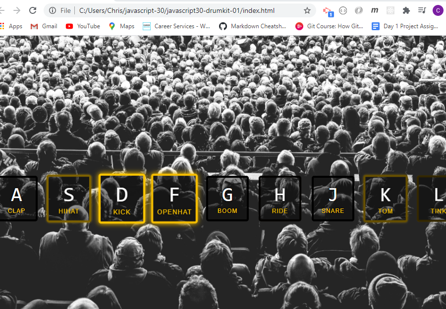

# Drum Kit, JavaScript30 Challenge Project #1

## Table of Contents

- [Installation](#installation)
- [Usage](#usage)
- [Credits](#credits)
- [MIT_License](#mit_license)

## Installation

1. Clone the repo and
2. Run the index.html file in default browser.

## Usage

This weather dashboard collects data from the Open Weather API and dynamically generates new information as the user updates their search city . The user's latest search saves to local storage and is populated when the page is refreshed. It was also designed to meet the criteria for GT Full-stack Flex program homework requirements.

It is built using vanilla Javascript by following a tutorial from the Javascript30 series .

Link to deployed application:

https://christinastarr19.github.io/javascript30-drumkit-01/

## Credits

This was a solo project completed as homework for the Georgia Tech, FullStack Flex program.

## MIT_License

Copyright (c) [2020][christina cunningham starr]

Permission is hereby granted, free of charge, to any person obtaining a copy
of this software and associated documentation files (the "Software"), to deal
in the Software without restriction, including without limitation the rights
to use, copy, modify, merge, publish, distribute, sublicense, and/or sell
copies of the Software, and to permit persons to whom the Software is
furnished to do so, subject to the following conditions:

The above copyright notice and this permission notice shall be included in all
copies or substantial portions of the Software.

THE SOFTWARE IS PROVIDED "AS IS", WITHOUT WARRANTY OF ANY KIND, EXPRESS OR
IMPLIED, INCLUDING BUT NOT LIMITED TO THE WARRANTIES OF MERCHANTABILITY,
FITNESS FOR A PARTICULAR PURPOSE AND NONINFRINGEMENT. IN NO EVENT SHALL THE
AUTHORS OR COPYRIGHT HOLDERS BE LIABLE FOR ANY CLAIM, DAMAGES OR OTHER
LIABILITY, WHETHER IN AN ACTION OF CONTRACT, TORT OR OTHERWISE, ARISING FROM,
OUT OF OR IN CONNECTION WITH THE SOFTWARE OR THE USE OR OTHER DEALINGS IN THE
SOFTWARE.
